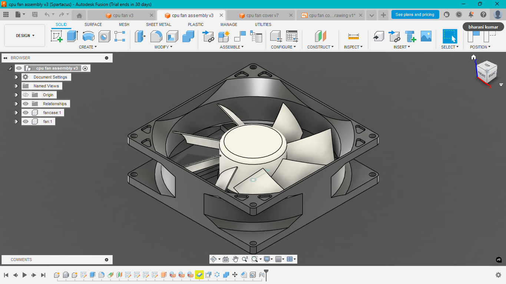
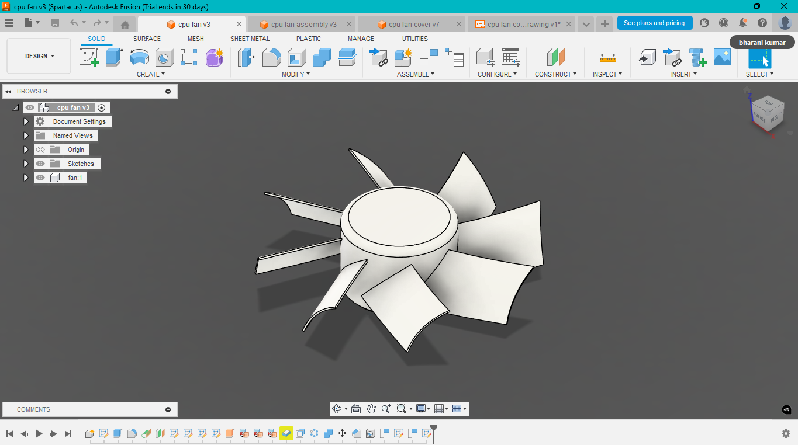
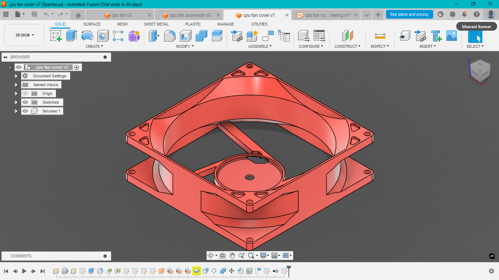

# 💻 Design and Fabrication of CPU Fan and Case using Fusion 360

**Mini Project by Bharanikumar Arunagiri**

This mini project involved designing and 3D printing a custom CPU fan and protective case using Autodesk Fusion 360. The primary goal was to develop a compact, thermally efficient design suitable for personal computing devices. The model was sliced in Ultimaker Cura and fabricated using FDM 3D printing. Although the model was not motor-tested, the project demonstrates skills in CAD design, 3D printing preparation, and physical prototyping.

---

## 🧰 Tools Used

| Software     | Purpose                  |
|--------------|--------------------------|
| Fusion 360   | 3D design & drafting     |
| Cura         | Slicing for 3D printing  |
| 3D Printer   | Fabrication              |

---

## 📸 Design Showcase

  
*3d View Assembly*

  
*3d View of Fan*

  
*3d View of Cover*
---

## 🖼️ 2D Drafts

PDF views from different angles included in the repo:
- [Fan Draft View](images/figure4.png)
- [Cover Draft View](images/figure5.png)

---

## 🔗 Fusion 360 Links *(Login Required)*

- 
- 
- 

---

## 📄 PDF Report

You can [view the full mini project PDF here](./cpu%20fan%20mini%20project.pdf).

---

## ✅ Conclusion

This project helped reinforce skills in CAD modeling, design for additive manufacturing, and basic prototyping workflows.
